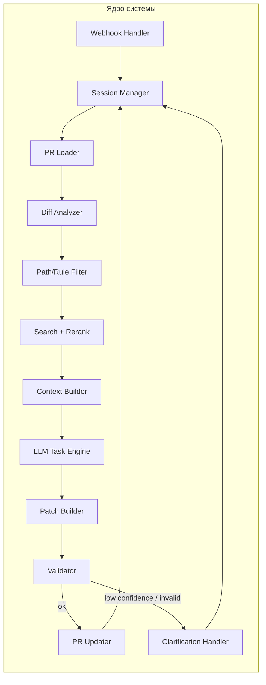

# C4 Component

```mermaid
flowchart LR
    subgraph Core["Ядро системы"]
        WH["Webhook Handler"]
        PL["PR Loader"]
        DA["Diff Analyzer"]
        PF["Path/Rule Filter"]
        SR["Search + Rerank"]
        CB["Context Builder"]
        LE["LLM Task Engine"]
        PB["Patch Builder"]
        VD["Validator"]
        CH["Clarification Handler"]
        PU["PR Updater"]
        SM["Session Manager"]
    end

    WH --> SM
    SM --> PL
    PL --> DA
    DA --> PF
    PF --> SR
    SR --> CB
    CB --> LE
    LE --> PB
    PB --> VD
    VD -->|ok| PU
    VD -->|low confidence / invalid| CH
    CH --> SM
    PU --> SM
```
