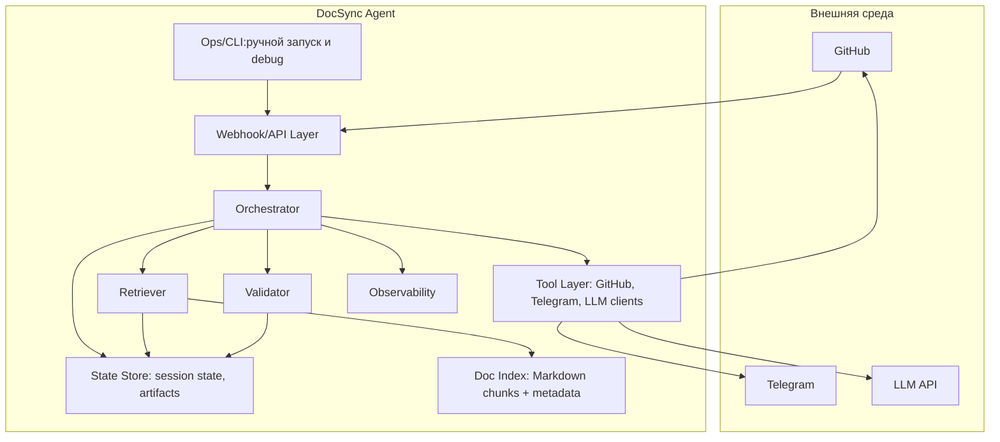

# C4 Container

```mermaid
flowchart TB
    subgraph UserSide["Внешняя среда"]
        GH["GitHub"]
        TG["Telegram"]
        LLM["LLM API"]
    end

    subgraph System["DocSync Agent"]
        FE["Ops/CLI:ручной запуск и debug"]
        API["Webhook/API Layer"]
        ORCH["Orchestrator"]
        RET["Retriever"]
        TOOL["Tool Layer: GitHub, Telegram, LLM clients"]
        STORE["State Store: session state, artifacts"]
        IDX["Doc Index: Markdown chunks + metadata"]
        VAL["Validator"]
        OBS["Observability"]
    end

    GH --> API
    FE --> API
    API --> ORCH
    ORCH --> RET
    RET --> IDX
    ORCH --> VAL
    ORCH --> TOOL
    ORCH --> STORE
    RET --> STORE
    VAL --> STORE
    ORCH --> OBS
    TOOL --> GH
    TOOL --> TG
    TOOL --> LLM
```
