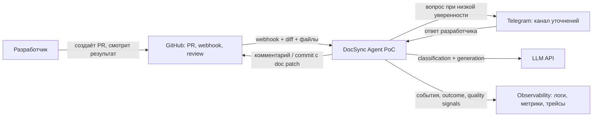

# C4 Context

```mermaid
flowchart LR
    Dev["Разработчик"]
    GH["GitHub: PR, webhook, review"]
    TG["Telegram: канал уточнений"]
    LLM["LLM API"]
    DOC["DocSync Agent PoC"]
    OBS["Observability: логи, метрики, трейсы"]

    Dev -->|"создаёт PR, смотрит результат"| GH
    GH -->|"webhook + diff + файлы"| DOC
    DOC -->|"комментарий / commit с doc patch"| GH
    DOC -->|"вопрос при низкой уверенности"| TG
    TG -->|"ответ разработчика"| DOC
    DOC -->|"classification + generation"| LLM
    DOC -->|"события, outcome, quality signals"| OBS
```
