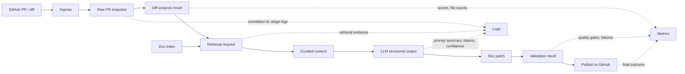

# Data Flow Diagram

Что хранится:

- в `State Store`: session state, краткие артефакты retrieval, structured output, validation status;
- в индексе: чанки Markdown и metadata;
- в логах: сокращённый контекст и служебные идентификаторы;
- в метриках: latency, error class, confidence, fallback rate, acceptance signals.
