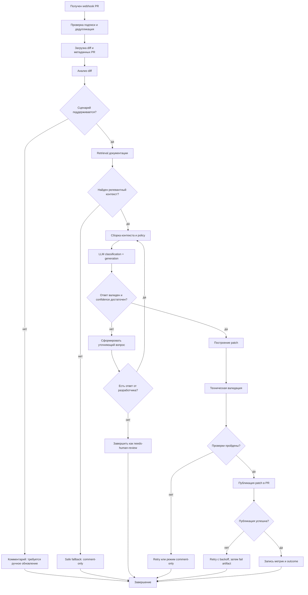

# Workflow Diagram

```mermaid
flowchart TD
    A["Получен webhook PR"] --> B["Проверка подписи и дедупликация"]
    B --> C["Загрузка diff и метаданных PR"]
    C --> D["Анализ diff"]
    D --> E{"Сценарий поддерживается?"}
    E -- "нет" --> E1["Комментарий: требуется ручное обновление"] --> Z["Завершение"]
    E -- "да" --> F["Retrieval документации"]
    F --> G{"Найден релевантный контекст?"}
    G -- "нет" --> G1["Safe fallback: comment-only"] --> Z
    G -- "да" --> H["Сборка контекста и policy"]
    H --> I["LLM classification + generation"]
    I --> J{"Ответ валиден и confidence достаточен?"}
    J -- "нет" --> K["Сформировать уточняющий вопрос"]
    K --> L{"Есть ответ от разработчика?"}
    L -- "нет" --> L1["Завершить как needs-human-review"] --> Z
    L -- "да" --> H
    J -- "да" --> M["Построение patch"]
    M --> N["Техническая валидация"]
    N --> O{"Проверки пройдены?"}
    O -- "нет" --> P["Retry или режим comment-only"] --> Z
    O -- "да" --> Q["Публикация patch в PR"]
    Q --> R{"Публикация успешна?"}
    R -- "нет" --> S["Retry с backoff, затем fail artifact"] --> Z
    R -- "да" --> T["Запись метрик и outcome"] --> Z
```
